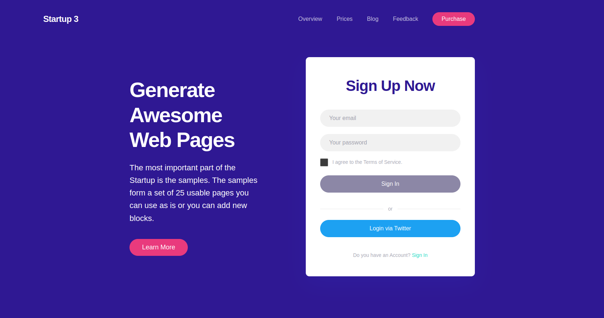
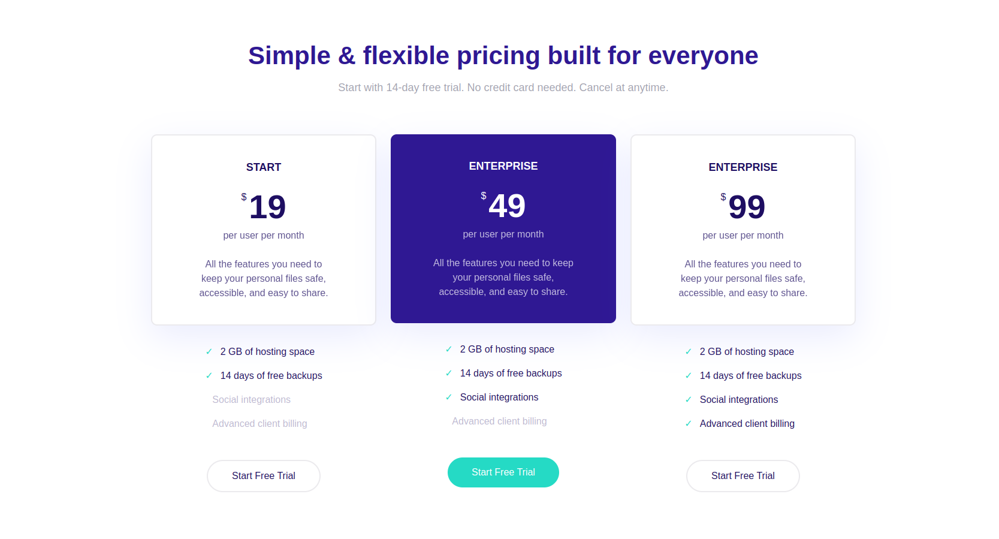
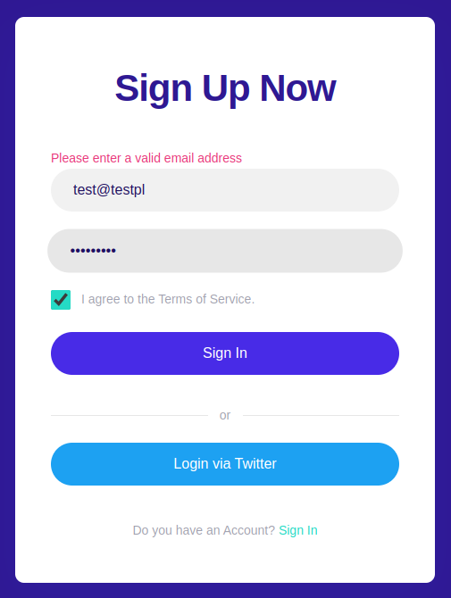
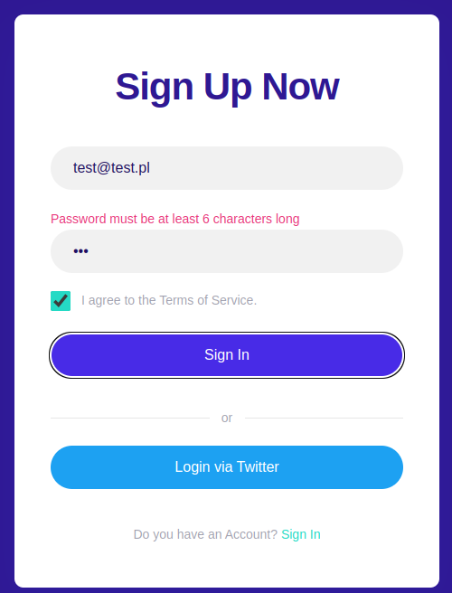
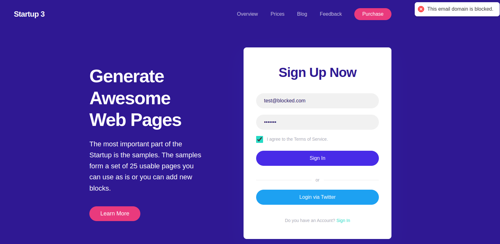
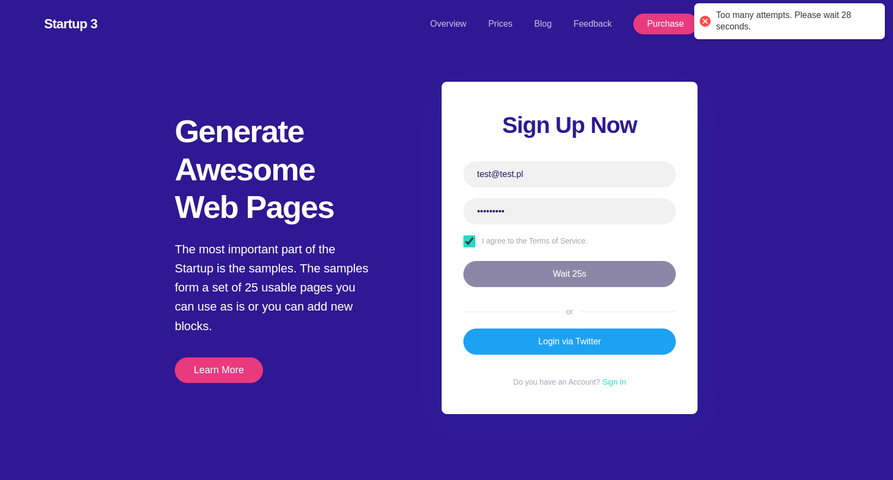
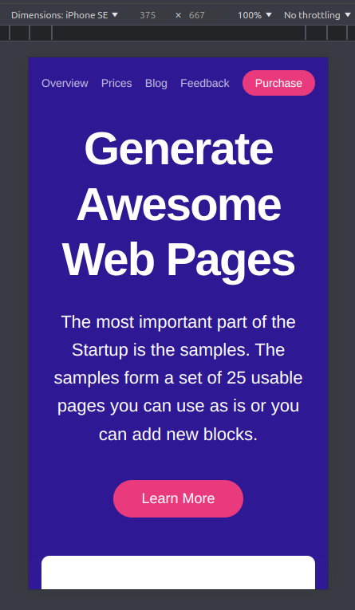
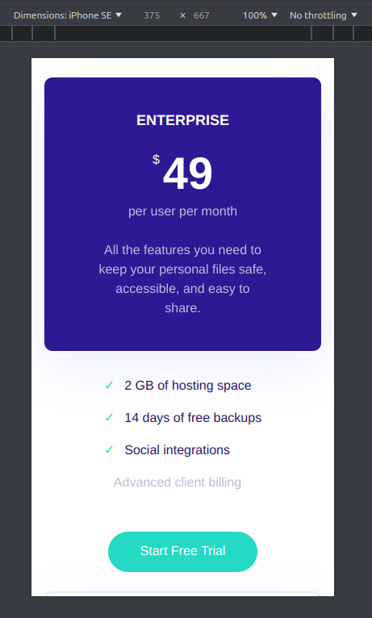

# Startup 3 Landing Page

A modern, responsive landing page with authentication functionality built using React, TypeScript, and Framer Motion.



## Features

### Authentication
- Email and password validation
- Rate limiting for login attempts
- Error handling and user feedback

### Pricing Plans
- Three-tier pricing structure
- Feature comparison
- Highlighted recommended plan
- Interactive cards with hover effects

### Animations
- Page transitions using Framer Motion
- Staggered animations for list items
- Hover and tap animations for buttons
- Smooth error message transitions

## Screenshots

### Desktop Views
- 
- 
- 
- 

### Error Handling & Rate Limiting
- 
- 
- 
- 
- 

### Mobile Views
- 
- 
- 

## Technology Stack

- React 18
- TypeScript
- Framer Motion
- SCSS Modules
- Jest & React Testing Library
- React Hot Toast

## Getting Started

1. Clone the repository:
```bash
git clone https://github.com/yourusername/startup-3-landing.git
```

2. Install dependencies:
```bash
npm install
```

3. Run the development server:
```bash
npm run dev
```
